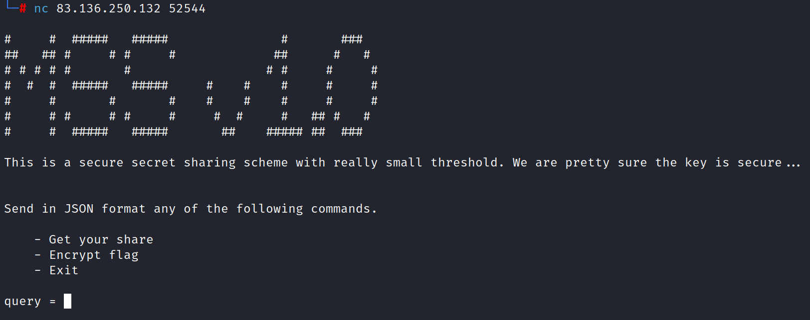
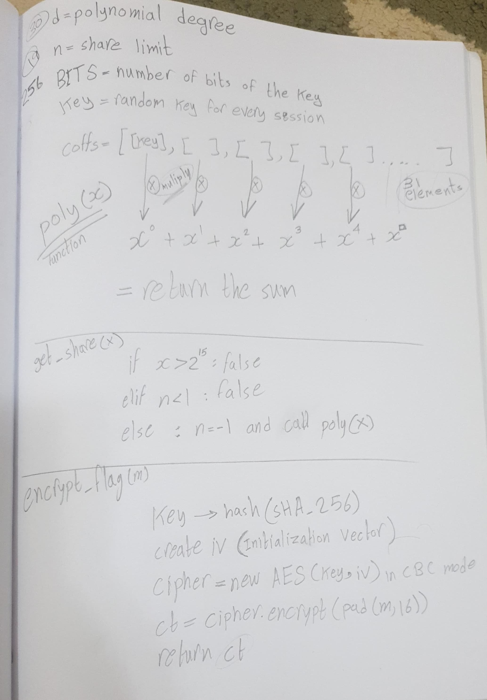
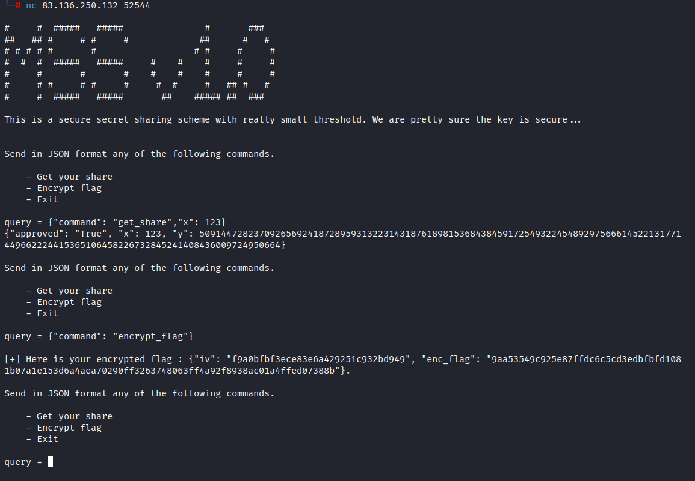
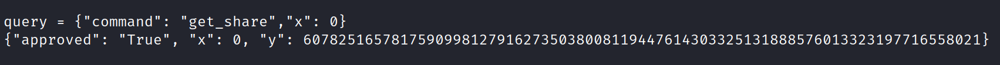
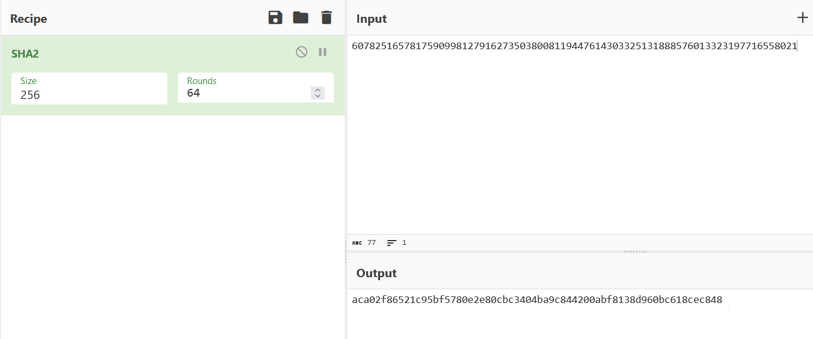
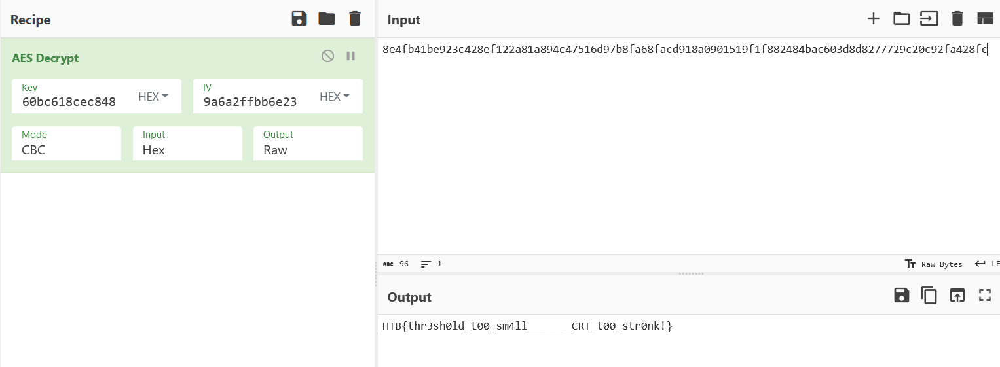

# CHALLENGE NAME: MSS #
<br /><br /><br />
The military possesses a server containing crucial data about the virus and potential cures, secured with encryption and a key distributed using a secret sharing scheme. However, authorized members holding parts of the key are infected, preventing access to the research. Fueled by your cryptography passion, you and your friends aim to hack into the server and recover the key. Can you succeed in this challenging mission?

<br /><br /><br />

This challenge is about understanding the code and finding the logical weakness that led to getting the key and decrypting the encrypted data.<br />

Here is the main page of the program 
<br /><br />



<br /><br />
After analyzing the code, I try to simplify the algorithm to understand what is happening. 
<br /><br />



<br /><br />
As written here, the program creates a coeffs array that contains the key and 30 random numbers.<br />
The user will send x to the program, and it will give him the sum using this algorithm.<br />

We are dealing with server using json format and there are three options: <br />
- Get your share ```{"command": "get_share","x": 123}``` here I can change x
- Encrypt flag ```{"command": "encrypt_flag"}```
- Exit no need to exit
<br />



<br /><br /><br />
So......
<br />
What if the user gives x = 0 ?<br />
All the numbers will become 0, becuse multiplying with 0 gives 0.<br />
But the key will multiple with 0^0, and what is 0^0 in Python?<br />
0^0 = 1 (Math people, conflict with Python, I want to find my flag)<br />
Which means that if we give the program x = 0, we will get the key in decimal format.<br />



<br />
Now let's hash it then use decrypt the encrypted data<br />



I will use [cyberchef](https://gchq.github.io/CyberChef/) to decrypt.<br />

I got the flag <br />




```HTB{thr3sh0ld_t00_sm4ll_______CRT_t00_str0nk!}```
